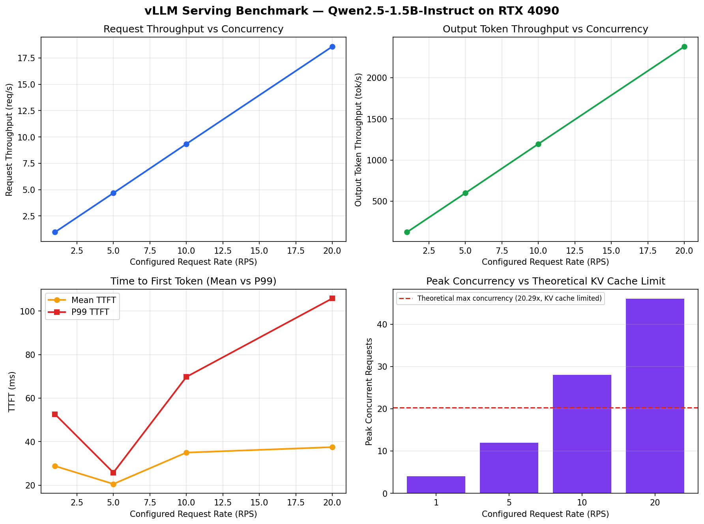

# vLLM推理服务部署与性能分析——完整复现指南

本文档记录了在单卡GPU上从零部署vLLM推理服务、执行benchmark压测、排查性能异常的完整过程，包括中途遇到的所有报错和解决方法。跟着本文档的步骤，可以在自己的GPU服务器上完整复现整个项目。

## 项目背景

目标：在RTX 4090上部署Qwen2.5-1.5B-Instruct模型的vLLM推理服务，理解PagedAttention和Continuous Batching机制，并通过压测量化不同并发下的吞吐量与延迟表现。

## 测试环境

| 项目 | 配置 |
|---|---|
| GPU | NVIDIA RTX 4090 (24GB) |
| 驱动/CUDA | Driver 580.126.09 / CUDA 13.0 |
| 系统 | Ubuntu (EXT4文件系统) |
| Python | 3.11（独立conda环境） |
| 模型 | Qwen2.5-1.5B-Instruct |
| 推理框架 | vLLM v0.27.1 |

---

## 一、环境搭建

### 1. 创建独立conda环境

```bash
conda create -n vllm-lab python=3.11 -y
conda activate vllm-lab
```

### 2. 安装vLLM

```bash
pip install vllm
```

网络慢可换国内镜像：

```bash
pip install vllm -i https://pypi.tuna.tsinghua.edu.cn/simple
```

验证安装：

```bash
python -c "import vllm; print(vllm.__version__)"
```

---

## 二、遇到的问题与解决方案（按实际排查顺序）

跑通一个真实的推理环境很少一帆风顺，以下按照实际踩坑顺序记录，方便对照排查。

### 问题1：`TypeError: type 'array.array' is not subscriptable`

**现象：** 首次运行推理脚本，模型加载阶段直接报错退出。

**原因：** `flashinfer-python` 包内部代码使用了 `array.array[int]` 这种类型标注写法，该写法需要Python 3.13+才支持，与当前Python 3.11环境不兼容。这是flashinfer这个可选加速组件本身的版本兼容性问题，与用户代码无关。

**解决：** flashinfer只是可选加速组件，vLLM实际使用的是FLASH_ATTN后端，直接卸载即可：

```bash
pip uninstall flashinfer-python -y
```

### 问题2：程序卡住不动，长时间无输出

**现象：** 运行推理脚本后，终端停在 `Using FlashAttention version 2` 这一行不再有任何输出，等待超过10分钟无响应。

**排查过程（记录完整排查思路，供参考）：**

1. **怀疑是torch.compile编译耗时**：第一次运行确实会因为CUDA Graph捕获等预热操作耗时较长，属正常现象。用 `nvidia-smi` 监控发现GPU利用率长期为0%、功耗维持在待机的P8状态（约6W），显存却占用了4GB左右——这个组合说明GPU本身闲置，问题不在GPU计算侧。

2. **怀疑是NCCL初始化卡死**：多卡/共享服务器上，NCCL做P2P通信探测或共享内存初始化时确实容易卡死不报错，是一个常见坑。尝试设置：

   ```bash
   export NCCL_P2P_DISABLE=1
   export NCCL_SHM_DISABLE=1
   ```

   问题未解决，排除此假设。

3. **用 `top` 检查CPU占用**：发现对应python进程CPU占用接近0%、状态为 `S`（sleeping），说明进程既不在用GPU算力也不在用CPU算力，而是在**等待某个外部资源**。

4. **真正原因浮出水面**：设置 `HF_HUB_OFFLINE=1` 强制离线运行后，程序立刻报错，暴露出真相：

   ```
   RuntimeError: Cannot find any model weights with `.../snapshots/...`
   ```

   模型的config、tokenizer等小文件此前已下载成功，但真正的权重文件（几GB的.safetensors）在后台一直卡在下载中，由于没有进度条显示，表现为"卡死"假象。

**最终解决：** 用能显示实时进度条的方式重新下载：

```bash
unset HF_HUB_OFFLINE
huggingface-cli download Qwen/Qwen2.5-1.5B-Instruct
```

（如果长期无法从Hugging Face下载，国内环境可优先尝试ModelScope：`export VLLM_USE_MODELSCOPE=True`，Qwen系列模型下载通常更稳定。）

**经验总结：** 遇到"卡住不动"的问题，排查顺序建议是：先用 `nvidia-smi` 看GPU是否真的在工作 → 再用 `top` 看CPU是否在工作 → 如果两者都空闲，大概率是在等待网络/IO，而不是计算类问题。不要一上来就怀疑NCCL、CUDA这类底层库，先用最简单的资源监控工具排除网络原因。

### 问题3：`ModuleNotFoundError: No module named 'flashinfer'`

**现象：** 解决了权重下载问题后，模型权重成功加载，但初始化Sampler（采样器）时报错。

**原因：** 问题1中把flashinfer完全卸载了，而vLLM初始化采样器时会尝试导入flashinfer模块判断是否可用，卸载后该判断逻辑没有做好容错，直接抛出异常中断启动。

**解决：** 不用重装flashinfer（重装会重现问题1的兼容性报错），而是用环境变量明确关闭flashinfer采样器：

```bash
export VLLM_USE_FLASHINFER_SAMPLER=0
```

### 问题4：`benchmark_serving.py` 提示已废弃

**现象：**

```
DEPRECATED: This script has been moved to the vLLM CLI.
Please use the following command instead:
    vllm bench serve
```

**原因：** vLLM较新版本已经把独立的压测脚本整合进统一CLI工具。

**解决：** 把命令开头的 `python benchmark_serving.py` 替换成 `vllm bench serve`，其余参数不变即可：

```bash
vllm bench serve --backend vllm --model <model_name> --num-prompts N --request-rate R
```

---

## 三、启动推理服务

模型权重下载完成、环境变量设置好之后，启动一个真实的OpenAI兼容API服务：

```bash
export VLLM_USE_FLASHINFER_SAMPLER=0

python -m vllm.entrypoints.openai.api_server \
    --model Qwen/Qwen2.5-1.5B-Instruct \
    --port 8000
```

看到以下日志代表服务就绪，此时保持该终端运行，不要关闭：

```
Uvicorn running on http://0.0.0.0:8000
```

启动过程中的关键日志信息，对应了vLLM的核心机制，值得关注：

```
GPU KV cache size: 664,784 tokens
Maximum concurrency for 32,768 tokens per request: 20.29x
```

这两行是PagedAttention显存管理的直接体现：vLLM根据显存动态计算出能缓存的KV Cache总token数，并据此估算理论最大并发容量。

---

## 四、执行Benchmark压测

新开一个终端，激活同一个conda环境后，用 `vllm bench serve` 对不同并发配置进行压测：

```bash
conda activate vllm-lab

vllm bench serve --backend vllm --model Qwen/Qwen2.5-1.5B-Instruct \
    --num-prompts 20 --request-rate 1 \
    --save-result --result-filename rate1.json

vllm bench serve --backend vllm --model Qwen/Qwen2.5-1.5B-Instruct \
    --num-prompts 50 --request-rate 5 \
    --save-result --result-filename rate5.json

vllm bench serve --backend vllm --model Qwen/Qwen2.5-1.5B-Instruct \
    --num-prompts 100 --request-rate 10 \
    --save-result --result-filename rate10.json

vllm bench serve --backend vllm --model Qwen/Qwen2.5-1.5B-Instruct \
    --num-prompts 200 --request-rate 20 \
    --save-result --result-filename rate20.json
```

### 压测结果汇总

| Rate (RPS) | 请求吞吐(req/s) | 输出token吞吐(tok/s) | 峰值并发 | Mean TTFT (ms) | P99 TTFT (ms) | Mean TPOT (ms) |
|---|---|---|---|---|---|---|
| 1 | 0.97 | 124.07 | 4 | 28.80 | 52.60 | 4.88 |
| 5 | 4.68 | 599.05 | 12 | 20.56 | 25.78 | 5.24 |
| 10 | 9.34 | 1195.83 | 28 | 34.99 | 69.74 | 5.87 |
| 20 | 18.58 | 2378.47 | 46 | 37.47 | 105.80 | 6.85 |



**观察结论：**

- 请求吞吐量和token吞吐量随并发配置基本呈线性增长，测试范围（RPS 1-20）内未观察到明显的吞吐瓶颈，说明Continuous Batching有效地把提升的并发转化为了吞吐提升。
- TTFT/TPOT随并发上升有小幅增长，符合预期，未出现台阶式劣化。
- 峰值并发请求数（rate=20时为46）超过了启动日志给出的理论值20.29——原因是理论值按每个请求占满32768 token最坏情况估算，而实测每个请求仅用1024输入+128输出token，实际显存占用远小于最坏情况，因此能容纳更多并发，这也印证了PagedAttention"按需分配"而非"按最坏情况预留"的实际收益。

---

## 五、一次异常延迟的排查过程（方法论示范）

在rate=5的**首次**测试中，出现过一组反常数据：

| 指标 | 数值 |
|---|---|
| Mean TTFT | 212.50 ms |
| Median TTFT | 37.11 ms |
| P99 TTFT | 4539.31 ms |

Median正常但Mean和P99被大幅拉高，说明并非整体系统性变慢，而是极少数请求出现严重延迟拖累了统计值。

**假设：** CUDA kernel首次JIT编译导致的确定性延迟——vLLM对部分batch size对应的kernel采用懒加载策略，首次遇到某并发规模可能触发运行时编译，导致恰好撞上编译过程的请求出现额外停顿。当时测试顺序恰好是rate=5首次将并发推到两位数，与该假设吻合。

**验证方法1——冷启动对照实验：** 完全重启服务，不做任何预热，直接以rate=5发起测试。若假设成立，该并发规模对应的kernel编译应必然在此次首测中再次触发。

**结果：** 异常未复现，TTFT各项指标恢复正常。**假设被证伪。**

**验证方法2——重复实验确认稳定性：** 连续重复5次相同配置的测试，记录P99 TTFT：

```
27.94 ms / 24.57 ms / 24.43 ms / 24.65 ms / 24.26 ms
```

5次全部稳定落在24-28ms区间，复现率0/5。

**最终结论：** 排除了vLLM内部机制导致的确定性延迟解释，判定该异常为一次性的系统层面偶发噪声（可能来源包括共享服务器上其他进程的瞬时资源抢占、Python垃圾回收停顿等非确定性因素），而非vLLM本身在该并发规模下的固有行为。

这个过程展示了压测中处理孤立异常点的规范方法论：**观察异常 → 提出机制层面假设 → 设计对照实验验证 → 假设不成立则修正结论 → 重复实验确认稳定性**，而非直接采信单次测量结果或简单归因。

---

## 六、常用排查工具速查

复现过程中遇到问题时，以下工具组合能快速定位问题类型：

| 工具 | 用途 |
|---|---|
| `nvidia-smi` | 查看GPU显存占用与利用率，判断GPU是否真的在工作 |
| `top` | 查看CPU占用，判断进程是在计算还是在等待 |
| `curl http://127.0.0.1:8000/health` | 检查API服务是否已就绪 |
| `py-spy dump --pid <PID>` | 打印卡住进程的调用栈，精确定位卡在哪一行代码 |
| `watch -n 1 nvidia-smi` | 持续监控GPU状态变化 |

---

## 后续可扩展方向

- 加入量化模型（如AWQ）对比，量化前后的吞吐/显存/生成质量权衡
- 使用PyTorch Profiler对推理过程做更细粒度的时序分析
- 测试更高并发（>20 RPS）下是否出现真正的吞吐瓶颈拐点，与理论KV Cache容量上限做对照
